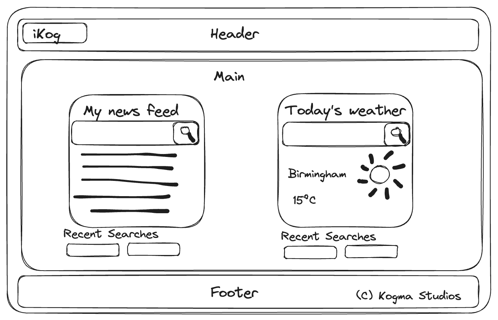

# iKog - An Internet Homepage

## Description

iKog is a clone of the discontinued iGoogle homepage application, presenting the user with various widgets of information i.e. news, weather.

This information is pulled from 2 specific API endpoints:

- New York Times
- Open Weather

The production website is deployed [here](https://stefan4d.github.io/kogma-ikog/).

## How to use iKog

### News Search

- Search for your desired news article topic in the left-hand (large screens) / top search box (mobile devices) and hit search!
- You will be presented with up to 5 articles relating to your search term.
- If you haven't searched for any topic then you will see the Top Stories from the New York Times.

### Weather Search

- Search for your desired location in the right-hand (large screens) / bottom search box (mobile devices) and hit search!
- The weather for your searched location will then display!
- If you haven't searched for anywhere yet, you will get a placeholder for the weather in London!

## Team

The team that built iKog is:

- [Stefan (Stefan4D)](https://github.com/Stefan4D)
- [Joseph (ContentCommando)](https://github.com/ContentCommando)
- [Djam88](https://github.com/Djam88)

---

## Mark Scheme Compliance

### Technical Acceptance Criteria

| Item                                                                                                                                                                                                                                                                                                                                                           | Evidence                                                                                                                                                                                                                                                                                                                                           |
| -------------------------------------------------------------------------------------------------------------------------------------------------------------------------------------------------------------------------------------------------------------------------------------------------------------------------------------------------------------- | -------------------------------------------------------------------------------------------------------------------------------------------------------------------------------------------------------------------------------------------------------------------------------------------------------------------------------------------------- |
| Satisfies the following code requirements:  Application uses at least two server-side APIs.  Application uses client-side storage to store persistent data.  Application doesn't use JS alerts, prompts, or confirms (uses modals instead).  Application uses Bootstrap.  Application is interactive (accepts and responds to user input). | The built application uses the OpenWeather Forecast5 API and New York Times API.  Uses localStorage to store the search history for news articles.  Does not use alerts, prompts, or confirms.   Application uses Bootstrap v5.3.  Application accepts user input to search for a weather location or to search for news articles. |

### Concept

| Item                                                                  | Evidence                                                                                                                                                                                              |
| --------------------------------------------------------------------- | ----------------------------------------------------------------------------------------------------------------------------------------------------------------------------------------------------- |
| Application should be a unique and novel idea.                        | The application is a clone of the iGoogle application discontinued in 2013, revitalised using modern APIs to pull in information based on the user inputs.                                            |
| Your group should clearly and concisely articulate your project idea. | The single page brief articulates the core concept of the project and is available read-only [here](https://docs.google.com/document/d/17QqUODR-QqmkcWoApuIo8nOr5fD_xjKaZLZKVEMAWkk/edit?usp=sharing) |

The following is a wireframe of the overall concept.

### Deployment

| Item                              | Evidence                                                             |
| --------------------------------- | -------------------------------------------------------------------- |
| Application deployed at live URL  | Live application deployed at: https://stefan4d.github.io/kogma-ikog/ |
| Application loads with no errors. | No visual defects   No console errors                           |
| Application GitHub URL submitted. | URL submitted                                                        |

### Repository Quality

| Item                                                                                                    | Evidence                                                                                                                                                                                                                  |
| ------------------------------------------------------------------------------------------------------- | ------------------------------------------------------------------------------------------------------------------------------------------------------------------------------------------------------------------------- |
| Repository has a unique name.                                                                           | Unique name used                                                                                                                                                                                                          |
| Repository follows best practices for file structure and naming conventions.                            | Standard file naming conventions used                                                                                                                                                                                     |
| Repository follows best practices for class/id naming conventions, indentation, quality comments, etc.  | All multi-word variables in JavaScript use camelCase   Indentation within code follows best practice    Comments have been included within the files to describe behaviour and/or intent of the code. |
| Repository contains multiple descriptive commit messages.                                               | Multiple commits included demonstrating incremental build of final submission. Each has a clear description of changes made.                                                                                              |
| Repository contains quality README file with description, screenshot, and link to deployed application. | This README document.                                                                                                                                                                                                     |

### Application Quality

| Item                                                           | Evidence                                                                                                                                            |
| -------------------------------------------------------------- | --------------------------------------------------------------------------------------------------------------------------------------------------- |
| Application user experience is intuitive and easy to navigate. | Application user interface matches the wireframe from the original design and uses intuitive elements e.g. click on a history item to search again. |
| Application user interface style is clean and polished.        | As above                                                                                                                                            |
| Application is responsive.                                     | Application uses the Bootstrap grid system to display content in a responsive way.                                                                  |

## License

Released under the MIT license. Full details in [LICENSE](./LICENSE).
